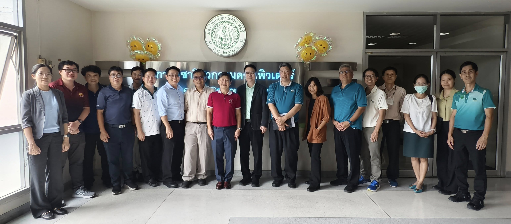

On **July 30, 2025**, the **Department of Computer Engineering**, Faculty of Engineering, Kasetsart University, hosted a strategic meeting with faculty representatives from various engineering departments to initiate the **AI-Integrated Engineering Program (AIEP)** — a cross-disciplinary collaboration designed to empower the next generation of engineers with deep domain knowledge and advanced AI capabilities.

The meeting fostered open, constructive, and forward-looking discussions on curriculum design, academic pathways, and strategic collaboration opportunities under the concept of **AI x Engineering**.

🙏 The department extends its appreciation to:  
- All participating departments for their active contributions  
- **Assoc. Prof. Dr. Jittat Fakcharoenphol** and **Assoc. Prof. Dr. Aime Chanlekha** for co-developing the curriculum framework  
- **Dean Prof. Dr. Wanchai Yodsudjai** and **Assoc. Dean for Academic Affairs Dr. Dulpichet Rerkpreedapong** for their strong leadership and support

During the meeting, the program's official name was confirmed:

> **AIEP – AI-Integrated Engineering Program**

The AIEP initiative represents a bold step forward in reimagining engineering education — empowering students to go **deep in AI** while remaining **strong in core engineering disciplines**.

The Department of Computer Engineering is committed to working closely with partner departments to develop the curriculum, engage with industry collaborators, and establish a new model of interdisciplinary engineering education aligned with global trends and local impact.

---

### #AIxEngineering #AIEP #KasetsartEngineering #EngineeringEducation #AI #FutureEngineers #GlobalTalent #InterdisciplinaryEducation
