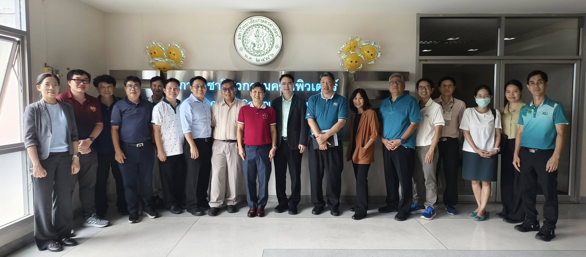
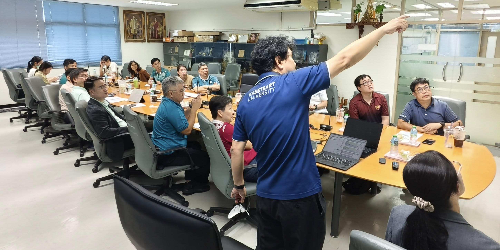
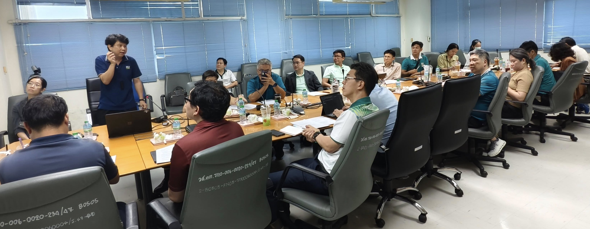

เมื่อวันที่ **30 กรกฎาคม 2568** ภาควิชาวิศวกรรมคอมพิวเตอร์ คณะวิศวกรรมศาสตร์ มหาวิทยาลัยเกษตรศาสตร์ ได้จัดการประชุมเชิงกลยุทธ์ร่วมกับผู้แทนจากภาควิชาวิศวกรรมศาสตร์สาขาต่าง ๆ  
เพื่อริเริ่มโครงการ **AI-Integrated Engineering Program (AIEP)** — ความร่วมมือข้ามศาสตร์เพื่อสร้างวิศวกรรุ่นใหม่ที่มีทั้งความเชี่ยวชาญเฉพาะทางและทักษะ AI ขั้นสูง

การประชุมเป็นไปอย่างเปิดกว้าง สร้างสรรค์ และมุ่งสู่อนาคต  
โดยเน้นการออกแบบหลักสูตร เส้นทางการเรียน และโอกาสความร่วมมือเชิงกลยุทธ์ภายใต้แนวคิด **AI-Integrated Engineering**

🙏 ขอขอบคุณทุกภาควิชาที่เข้าร่วมและร่วมแสดงความคิดเห็นอย่างแข็งขัน  
- ขอบคุณ **รองศาสตราจารย์ ดร.จิตร์ทัศน์ ฝักเจริญผล** และ **รองศาสตราจารย์ ดร.หัชทัย ชาญเลขา** ที่ร่วมกันวางโครงร่างหลักสูตร  
- ขอบคุณ **ศาสตราจารย์ ดร.วันชัย ยอดสุดใจ** คณบดี และ **รองศาสตราจารย์ ดร.ดุลย์พิเชษฐ์ ฤกษ์ปรีดาพงศ์** รองคณบดีฝ่ายวิชาการ สำหรับการสนับสนุนอย่างเต็มที่

ในการประชุมครั้งนี้ ได้มีการยืนยันชื่ออย่างเป็นทางการของโครงการว่า

> **AIEP – AI-Integrated Engineering Program**

AIEP เป็นก้าวสำคัญของการปรับรูปแบบการศึกษาวิศวกรรม  
เพื่อให้นิสิตสามารถเรียนรู้ **AI อย่างลึกซึ้ง** ควบคู่กับการเป็น **ผู้เชี่ยวชาญในสาขาวิศวกรรมหลัก**

ภาควิชาวิศวกรรมคอมพิวเตอร์พร้อมทำงานอย่างใกล้ชิดกับภาควิชาพันธมิตร  
เพื่อร่วมกันพัฒนาหลักสูตร เชื่อมโยงกับภาคอุตสาหกรรม และสร้างต้นแบบใหม่ของการศึกษาวิศวกรรมที่ขับเคลื่อนด้วยการบูรณาการ — สอดคล้องกับแนวโน้มระดับโลก และตอบโจทย์บริบทของไทย

---

### #AIxEngineering #AIEP #KasetsartEngineering #EngineeringEducation #AI #FutureEngineers #GlobalTalent #InterdisciplinaryEducation
